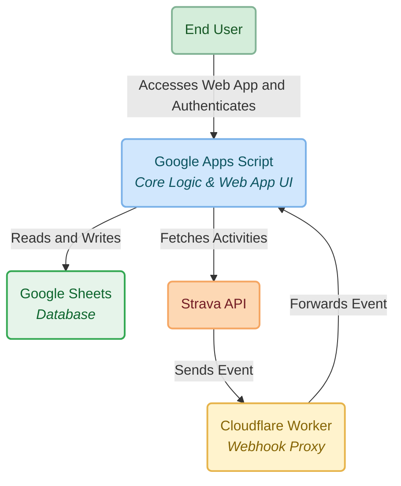

# Swimming Club - Strava Integration Hub

An all-in-one web application built on Google Apps Script and Google Sheets to create a community hub for a sports club. It integrates deeply with the Strava API to automatically track activities, manage leaderboards, and host events. While built for swimming, it can be easily adapted for other sports like running or cycling. **This project was developed with the assistance of Google's Gemini, which served as an AI coding partner to help write, debug, and document the code.**


## Key Features

- **Strava Integration:** Secure OAuth2 authentication for members and real-time activity updates.
- **Automated Activity Sync:** A fallback system with background triggers periodically syncs activity data for all authorized members.
- **Optional Real-time Webhooks:** A secure Cloudflare Worker acts as a proxy to instantly receive events from Strava, triggering immediate data updates for a real-time experience.


## Project Architecture



    
This project consists of two main components that work together:

- **Google Apps Script (Backend & Frontend):** The core logic, data storage (Google Sheets), and web app UI server.
- **Cloudflare Worker (Webhook Proxy):** A secure, public-facing endpoint for Strava Webhooks. It resolves an architectural conflict where Strava's requirement for an instant `200 OK` response clashes with Google Apps Script's `302 Redirect` behavior, ensuring reliability and security.


## Setup and Installation Guide

Follow these steps to set up and deploy your own instance of the club hub.

### Prerequisites

* **Google Account** (for Google Sheets and Apps Script).
* **Cloudflare Account** (only if using webhooks). You can create one at [Cloudflare](https://dash.cloudflare.com). 
* **Node.js** and **npm** installed on your machine (only if using webhooks).
* **Strava API Application**. You can create one at [Strava's API Settings](https://www.strava.com/settings/api).

### Step 1: Strava API Application Setup


1.  Create a new application on the Strava API page.
2.  Note down your **Client ID** and **Client Secret**.
3.  For the **Authorization Callback Domain**, enter `script.google.com`.

> [!NOTE]
> *Please be aware that new Strava API applications have usage limits. New applications have a limit on the number of unique athletes that can authorize it. If your club is large, you must request an increase to allow all members to connect.*


### Step 2: Google Sheets & Apps Script Setup

1.  **Create the Spreadsheet:**
    * Create a new, blank Google Sheet. This will be your database.
    * To set up the required sheet tabs and headers, please open the sample file `assets/dbn.xlsx` located in this repository.
    * Use this file as a template to create the necessary sheets (`Database`, `Activities`, `Events`, etc.) with their corresponding columns in your own Google Sheet.


2.  **Create the Apps Script Project:**
    * In your new Google Sheet, go to `Extensions > Apps Script`.
    * Copy all the code from the `google_apps_script` directory into your Apps Script project, creating new files as needed for each `.js` and `.html` file.
    * Copy the content of `appsscript.json` into the `appsscript.json` file in the editor.

3.  **Set up Script Properties:**
    * In the Apps Script editor, go to `Project Settings`.
    * Click `Edit script properties`.
    * Add the following properties:
        * `STRAVA_CLIENT_ID`: Your Client ID from Strava.
        * `STRAVA_CLIENT_SECRET`: Your Client Secret from Strava.
        * `STRAVA_REDIRECT_URI`: Your GAS web app URL after deploying.
        * **(For Webhooks)** `CLOUDFLARE_WORKER_URL`: You will fill this in after deploying the worker.
        * **(For Webhooks)** `STRAVA_VERIFY_TOKEN`: A strong, unique string you create.
        * **(For Webhooks)** `WORKER_SHARED_SECRET`: A very strong, random password you create.

    > [!TIP]
    > ***How to Create a Strong Secret for `WORKER_SHARED_SECRET` or `STRAVA_VERIFY_TOKEN`***
    >
    > *For security, this secret should be a long, random string. Use a password manager to generate one, or run one of the following commands in your terminal and copy the output.*
    >
    > - **On macOS or Linux:**
    >   ```bash
    >   openssl rand -base64 32
    >   ```
    >
    > - **On Windows (in PowerShell):**
    >   ```powershell
    >   $bytes = New-Object byte[] 32; (New-Object System.Security.Cryptography.RNGCryptoServiceProvider).GetBytes($bytes); [System.Convert]::ToBase64String($bytes)
    >   ```

4.  **Deploy the Web App:**
    * In the editor, click **Deploy > New deployment**.
    * Select Type: **Web app**.
    * Configure: **Execute as:** `Me`, **Who has access:** `Anyone`.
    * Click **Deploy**.
    * Copy the **Web app URL** (the one ending in `/exec`).

### Step 3: Cloudflare Worker Setup (For Webhooks)

This section guides you through creating and deploying the webhook proxy.

1.  **Create the Worker Project:**
    * In your terminal, navigate to where you want to store your projects.
    * Run the Wrangler command to create a new worker project. We'll name it `strava-webhook-proxy`.
    ```bash
    npx wrangler init strava-webhook-proxy
    ```
    * This will create a new folder named `strava-webhook-proxy` with template files.

2.  **Add the Project Code:**
    * Open the newly created `strava-webhook-proxy` folderfolder.
    * Replace the entire content of this file with the code from the `strava-webhook-proxy/src/index.js` file in this repository.

3.  **Set Up Secrets:**
    * In your terminal, navigate into the worker's directory: `cd strava-webhook-proxy`.
    * Log in to Cloudflare: `wrangler login`.
    * Set up the necessary secrets. Wrangler will prompt you to paste each secret value.

    > [!NOTE]
    > *For each command below, run the command, then paste the corresponding value when prompted and press Enter.*

    * **Set the GAS Web App URL:**
        ```bash
        npx wrangler secret put GAS_WEB_APP_URL
        ```
        *(Paste the Web app URL ending in `/exec` from Step 2.4)*

    * **Set the Strava Verify Token:**
        ```bash
        npx wrangler secret put STRAVA_VERIFY_TOKEN
        ```
        *(Paste the exact same token you set in your GAS Script Properties)*

    * **Set the Shared Secret:**
        ```bash
        npx wrangler secret put WORKER_SHARED_SECRET
        ```
        *(Paste the exact same strong password you generated and set in your GAS Script Properties. This is crucial for security.)*


4.  **Deploy the Worker:**
    * From within the worker's directory, run the deploy command:
    ```bash
    npx wrangler deploy
    ```
    * After deployment, Wrangler will output the public URL of your worker. **Copy this worker URL**.


### Step 4: Finalizing Connections

1.  **Update GAS Properties:** Go back to your GAS Script Properties and fill in the `CLOUDFLARE_WORKER_URL` with the URL you just copied from the worker deployment.
2.  **Run Setup Functions:** In the GAS editor, run these functions manually one by one from the "Run" menu:
    * `setupWorkerUrl()` (if using webhooks)
    * `setupWebhookSecret()` (if using webhooks)
3.  **Create Webhook Subscription:** Run the `createWebhookSubscription()` function from the GAS editor to tell Strava to start sending events to your Worker.
4.  **Set up Triggers:** In the GAS editor, go to `Triggers` and create triggers for the following functions based on your setup:
    * `processCommunityChallenges`: Time-driven, every hour.
    * **If using Webhooks:**
        * `monitorWebhookHealth`: Time-driven, every day.
    * **If NOT using Webhooks:**
        * `processActivitySyncQueue`: Time-driven, every 15 minutes.
        * **(For Webhooks)** `CLOUDFLARE_WORKER_URL`: You will fill this in after deploying the worker.

## License

This project is licensed under the MIT License.